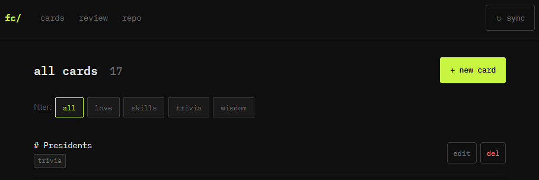

# Overview
spaced repetition app

# Why?
* off the shelf apps didn't solve all my needs (for free)
* I want spaced repetition on notes built with markdown that's backed up by a git repo

# Screenshot

# Setup
1. generate ssh keys: `ssh-keygen -t ed25519 -f ~/.ssh/flashcards_deploy -C "flashcards-app"`
    * this will create two files:
        1. ~/.ssh/flashcards_deploy private key (goes in .env as GIT_SSH_KEY_PATH)
        1. ~/.ssh/flashcards_deploy.pub public key (goes in Github)
1. update the env vars in .env
1. run locally with `just run`